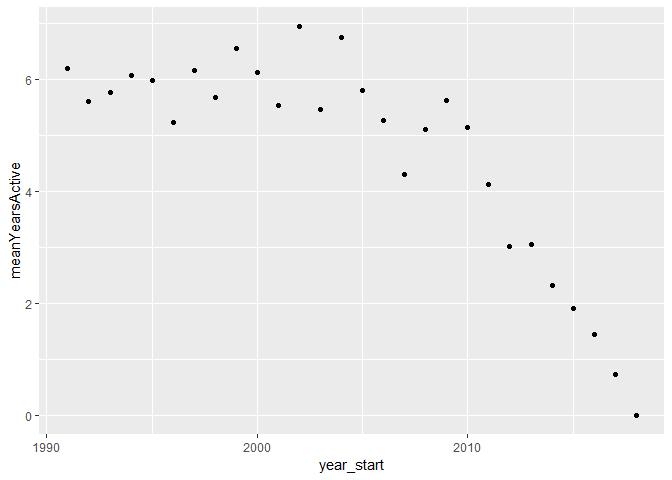

Tutorial 5: Data Analysis
================

This week's tutorial will intoduce more helpful functions for data transformation such as `mutate()`, `transmutate()`, `groupBy()` and `ungroup()`. These functions will then be used in conjunction with functions from previous weeks to create graphs using the `ggplot` package.

Getting Started
---------------

-   Open up a new R Script in R Studio.

-   Set the working directory to **R Tutorials**.

-   Load the `tidyverse` package.

-   Download the [**player\_data.csv**](https://github.com/kellya72/R-tutorials/blob/master/Tutorial%205/player_data.csv) file from the **Tutorial 5** folder.

-   Read the dataset into R, assigning it the name `playerData`.

The `mutate()` and `transmute()` Functions
------------------------------------------

### `mutate()`

-   The `mutate()` function allows you create new columns (variables) that are functions of existing columns and adds them to the dataframe.

-   For example, the `playerData` dataset has two variables `year_start` and `year_end` which represent the year a player started their career and the year they stopped playing professionally. It is therefore possible to add a new column `years_active` to the existing dataset by doing the following:

``` r
playerData <- mutate(playerData, years_active= year_end - year_start)
```

-   It is possible to create multiple new variables within the same `mutate()` function using the following format: `mutate(data, newVariable1, newVariable2, newVariable3, ...)`.

### `transmute()`

-   If you only wish to keep the new variables you have created, you can do so using the `transmute()` function as shown below:

``` r
transmute(playerData, years_active= year_end - year_start)
```

**Exercise 1: The `nycflights13` package contains the `flights` dataset. Install and load the package to access the dataset. Add a new variable to the dataset called `kmPerMinute` by dividing the `distance` variable by the `air_time` variable.**

`group_by()` and `ungroup()`
----------------------------

### `group_by()`

-   The `group_by()` function groups entries in a dataset by given variables.

-   This is particularly useful when used in conjunction with the `summarise()` function.

-   Try running the following code which groups the players in the dataset by their college and then finds the average number of years players from different colleges are active.

``` r
byCollege <- group_by(playerData, college)
summarise(byCollege, averageYearsActive= mean(years_active))
```

    ## # A tibble: 474 x 2
    ##    college                        averageYearsActive
    ##    <fct>                                       <dbl>
    ##  1 ""                                           4.54
    ##  2 Acadia University                            0   
    ##  3 Alabama - Huntsville                         0   
    ##  4 Alabama A&M University                       0   
    ##  5 Alabama State University                     1   
    ##  6 Albany State University                      8.6 
    ##  7 Alcorn State University                      6.25
    ##  8 Alliance College                             0   
    ##  9 American International College              10   
    ## 10 American University                         14   
    ## # ... with 464 more rows

**Exercise 2: Group the dataset using the `year_start` variable and then find the maximum `year_end` associated with each starting year.**

**Exercise 3: Group the `flights` dataset by `dest` and `carrier` then find the average distance for each grouping.**

### `ungroup()`

-   If you wish to remove a grouping, you can do so simply by using the `ungroup()` function as follows:

``` r
ungroup(byCollege)
```

Data Visualisation
------------------

-   Before plotting a graph it is often useful to employ some data manipulation techniques on a dataframe.

-   This allows us to create plots that are more specific which can aid us in data analysis.

-   Before continuing on it might be helpful to look over **Tutorial 3** to recap on plotting using `ggplot`.

-   Some of the following functions used have been previously demonstrated in **Tutorial 4**.

-   This section should help to consolidate what you have already learned while also incorporating the new techniques from this week.

### Example 1

Look at the following code. Do you understand what the functions are doing and what the resulting graph is representing?

``` r
playersAfter1990 <- filter(playerData, year_start>1990)
playersAfter1990 <- group_by(playersAfter1990, year_start)
averageYearsActive <- summarise(playersAfter1990, meanYearsActive = mean(years_active))

ggplot(data = averageYearsActive) + 
  geom_point(mapping = aes(x = year_start, y = meanYearsActive))
```



**Exercise 4: Using `playerData` create a boxplot comparing a players position and their weight. Note: In some cases players have switched positions and therefore their position values are equal to `G-F`, `F-C` etc. Do not alter the values, simply consider `G-F` as a seperate group to `G` and `F`.**

**Exercise 5: Create a bar plot using the positions variable but only for players of height of 6-8. Colour the bars based on the position.**

**Exercise 6: Group `playerData` by `college` and find the minimum `year_start` for each college. Create a bar plot of the number of colleges for each minimum start year up to and including 1955.**

For more information and examples on the functions used in this weeks tutorial and how to incorporate them in graphs, read the [data transformation](https://r4ds.had.co.nz/transform.html) and the [exploratory data analysis](https://r4ds.had.co.nz/exploratory-data-analysis.html) chapters from the [R for Data Science](http://r4ds.had.co.nz/index.html) book.
