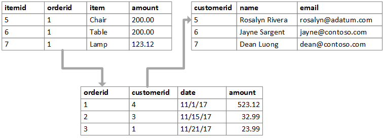
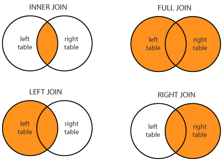

Tutorial 7: Relational Data
================

Often when conducting data analysis you will have deal with multiple different sets of data. It may be necessary to combine these different tables for the sake of your analysis. The name relational data comes from the fact that when combining different datasets it is the relationship between the datasets that is important.

A database is one of the most common uses of relational data.

Keys
----

-   A key is a variable which is used to connect two datasets. It is important that a key uniquely identifies an observation. Names and id numbers are commonly used as keys.

-   The figure below depicts a set of relational datasets. What are the keys in each table?



Image source: <https://docs.microsoft.com/en-us/azure/architecture/data-guide/relational-data/>

-   There are two main kinds of keys; *primary keys* and *foreign keys*.
    -   A *primary key* uniquely identifies each observation in a particular table.
    -   A *foreign key* is usually a primary key from one table that appears as a column in another where the first table has a relationship to the second.

### Flight Data

-   The `nycflights13` package contains five different datasets that relate to one another:
    -   `flights`
    -   `airlines`
    -   `airports`
    -   `planes`
    -   `weather`
-   Open and look at each dataset using the `View()` function. You will need to load the `nycflights13` package first.

-   Can you determine the columns (keys) which relate each table to one another?

-   A relationship diagram of the tables is shown below:


Image source: <https://r4ds.had.co.nz/relational-data.html>

-   The primary key in the `flights` dataset is the `tailnum` variable. It is important that you ensure that your primary key is unique for every observation in that table. For example, you wouldn't want to have a dataset of student data with two students having the same student id, if this was the case then the student id wouldn't uniquely identify each observation and would not be a primary key.

-   It is good practice to check if a variable you think may be a primary key is unique for all observations. You can do so as follows:

``` r
planes %>% 
  count(tailnum) %>% 
  filter(n > 1)
```

    ## # A tibble: 0 x 2
    ## # ... with 2 variables: tailnum <chr>, n <int>

-   Or alternatively without pipes:

``` r
filter(planes, count(planes, tailnum)[,2] >1)
```

    ## # A tibble: 0 x 9
    ## # ... with 9 variables: tailnum <chr>, year <int>, type <chr>,
    ## #   manufacturer <chr>, model <chr>, engines <int>, seats <int>,
    ## #   speed <int>, engine <chr>

-   As you can see the use of pipes makes the code less complicated.

-   We will be exploring the count function in detail next week.

**Exercise 1: Identify the primary key in the `airlines` table and verify that it is unique for all observations.**

-   The `flights` table lacks a primary key. It is sometimes useful when performing an analysis on relational data to include a primary key if one doesn't exist. You can do this easily using the `cbind()` function.

``` r
uniqueID <- c(1:nrow(flights))
flights <- cbind(uniqueID, flights)
```

Mutating Joins
--------------

-   We can us the relationships between the tables to combine data from one table to another.

-   There are four different kinds of joins:
    -   An inner join
    -   A left join
    -   A right join
    -   A full join
-   An **inner join** will join all observation from table a to table b by matching the keys between the two tables. An inner join will only keep the observations which have matching keys in **both** tables. For example if table a contained keys x, y, z and table b had keys w, x, y, then only the observations with keys x and y would be kept after the join.

-   A **left join** keeps all the observations in table a but only keeps the observations from table b which match with the keys from table a. Using the same example as above the observations with keys x, y and z would remain after performing a left join on tables a and b.

-   A **right join** is the exact opposite of a left join and will keep all the observations in table b but only the observations from table a which match with the keys from table b.

-   A **full join** keeps all observations from both tables.

-   Venn diagrams are commonly used to describe these joins:



Image source: www.dofactory.com

-   For example take the two tables `flights` and `airlines`. The primary key `carrrier` in the `airlines` table is a foreign key in the `flights` table. The left join function can be used to join the two tables as follows:

``` r
flightsLJ <- flights %>%
              left_join(airlines, by= "carrier")
```

-   The flights table now has 21 columns with the `carrier` variable as the last column. The `carrier` column isn't visible in the R console as the dataset is too wide. To see all the variables use the `View()` function.

**Exercise 2: Create a new smaller `flights` dataset which only contains the `flight`, `origin`, `dest` and `tailnum` variables and call it `flights2`. The left join the `planes` table to `flights2` so that `flights2` will now contain all the information about the planes used in each flight.**

-   When joining two tables the keys in the two tables may not have the same name in both tables. For example the `airports` table has a variable `faa` that contains the FAA code for each airport. When joining this table to the `flights` table you will notice that the `faa` variable matches to two variables in the `flights` table: `origin` and `dest`. Therefore you must specify the variable you wish to join the tables on as follows:

``` r
flightsLJ2 <- flights %>% 
                left_join(airports, c("origin" = "faa"))
```

Filtering Joins
---------------

-   Filtering joins are similar to mutating joins but they affect the observations in the tables, not the variables.

-   There are two different types of filtering joins:
    -   **Semi-join**: this keeps all the observations in table a which have a match in table b.
    -   **Anti-join**: this keeps all the observations in table a which do **not** have a match in table b.
-   For example perhaps you wanted to find out the top five airports with the most outward flights. When you have this information you then want all the flight information which just relates to flights leaving the five most popular airports. This can be done as follows:

``` r
top5origins <- flights %>%
  count(origin, sort = TRUE) %>%
  head(5)
flightsTop5 <- flights %>% 
  semi_join(top5origins)
```

**Execise 2: Find the five most popular destinations and obtain the flight data for only the flights going to those five destinations.**

**Exercise 3: Use the anti-join function to find out if any airlines have no flights in the `flights` dataset.**

Set Operators
-------------

-   Another method of comparing two datasets is the use of set operators.

-   Set operators only work if the two datasets you are comparing have the same variables in each.

-   There are three different kinds of set operators:
    -   `intersect(x,y)`- returns all observations which are in both table x and table y.
    -   `union(x,y)`- returns the unique observations in table x and y.
    -   `setdiff(x,y)`- returns all observations in table x but not in y.
